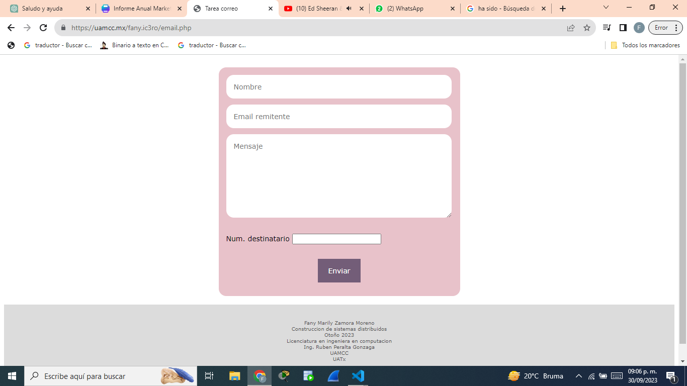
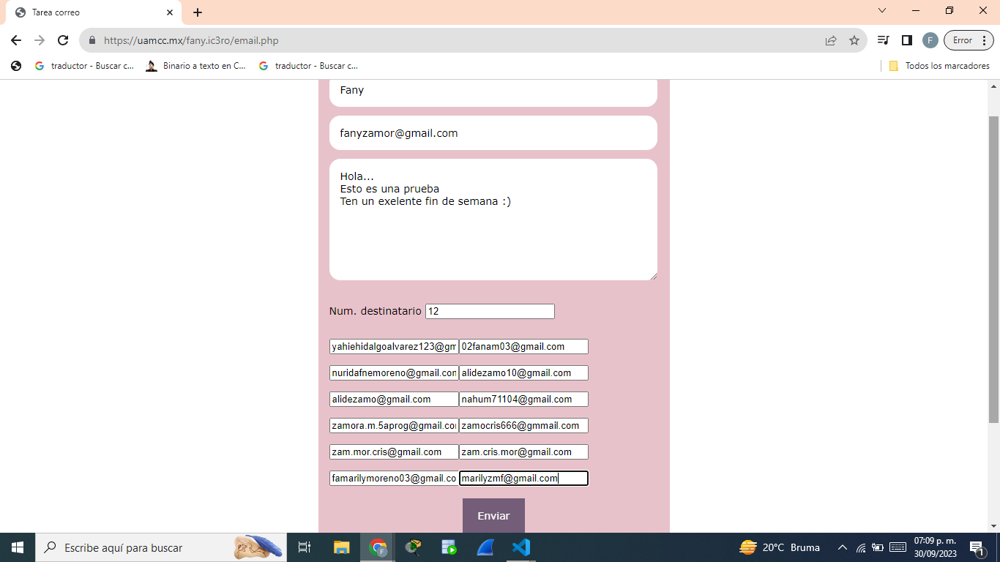
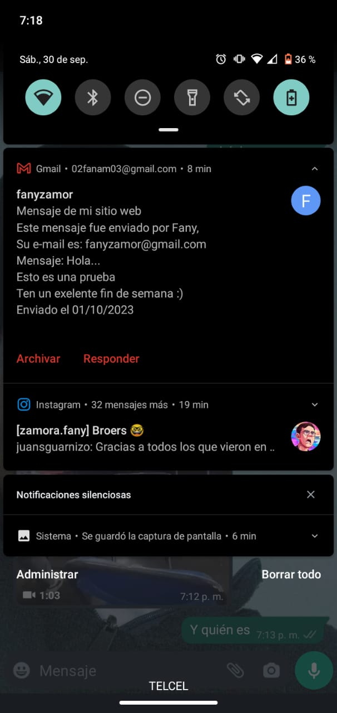
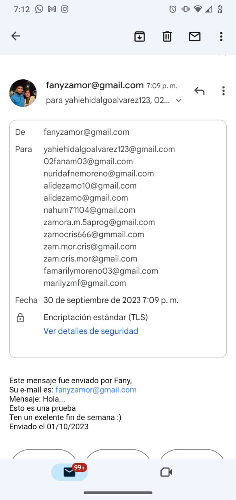

# Tarea Correo

Este proyecto es una aplicación web para enviar correos electrónicos a múltiples destinatarios. Los usuarios pueden completar un formulario para ingresar su nombre, dirección de correo electrónico, mensaje y el número de destinatarios. El sistema generará campos adicionales para las direcciones de los destinatarios y enviará el mensaje a todos ellos.

## Características

- **Formulario de Contacto**: Permite a los usuarios ingresar su nombre, correo electrónico, mensaje y el número de destinatarios.
- **Generación Dinámica de Campos**: Añade automáticamente campos de entrada para cada destinatario según el número especificado.
- **Envío de Correos Electrónicos**: Utiliza PHP para enviar el mensaje a todos los destinatarios listados en el formulario.

## Requisitos

- Servidor con soporte PHP
- Acceso a una cuenta de correo electrónico para enviar mensajes

## Proyecto

## Pruebas

Fany Marily Zamora Moreno
